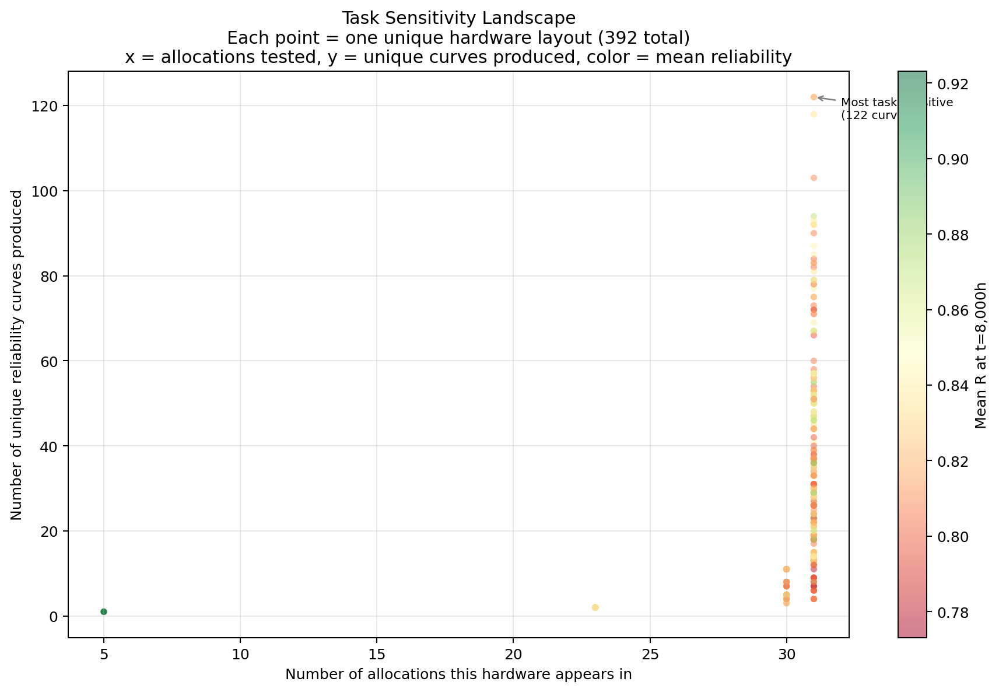
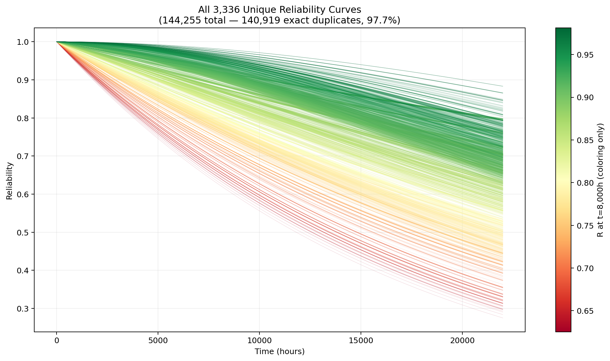
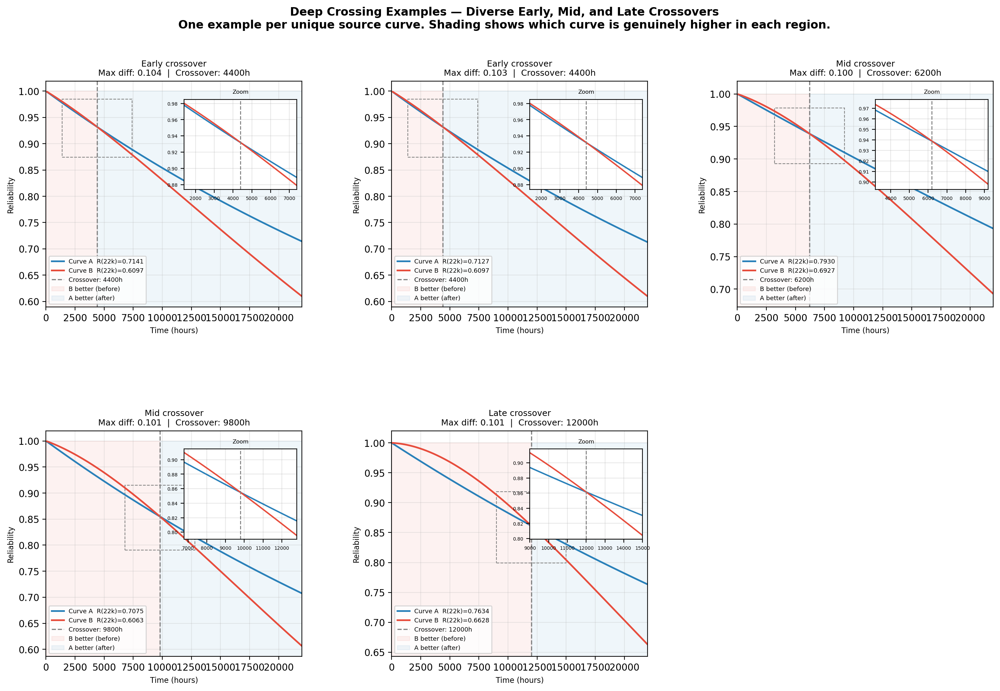
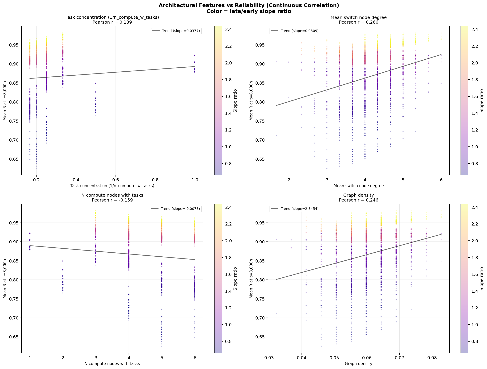

# ADES-v2: Data Discovery Report
**Project:** Reliability Estimation for Embedded Systems via Graph Neural Networks  
**Date:** April 2026  
**Authors:** Manuel Padilla  
**Repository:** [ADES-v2](https://github.com/MPadilla-Dev/ADES-V2)

---

## 1. Context and Motivation

Following your email regarding graph isomorphism and the `is_equal` function in `config.py`, we conducted a thorough analysis of the dataset structure before beginning model training. This report documents our findings from the data exploration phase and outlines the experimental plan for the GNN training phase.

Your note about isomorphism turned out to be one of the most important observations of the entire analysis. We detail the findings in Section 4.

---

## 2. Dataset Overview

The dataset consists of two raw sources:

| File | Description |
|---|---|
| `config_all_0_22000_100.csv` | 144,255 rows. Each row is one system configuration identified by `{allocation}_{config}`. Columns are reliability values at every 100 hours from t=0h to t=22,000h (221 time points). |
| `matrices.zip` | 144,286 adjacency matrix files. Each file describes one system graph — a header listing node names followed by a 30×30 adjacency matrix. 31 files have no matching CSV entry and are excluded. |

**Graph structure:** Every graph has exactly 30 nodes with a fixed composition:

| Node type | Count | Naming |
|---|---|---|
| Compute nodes | 6 | N1 – N6 |
| Switch nodes | 3 | S1 – S3 |
| Link nodes | 15 | N1S1, S1S2, ... (device pair fused) |
| Task nodes | 6 | T1\_1, T1\_2, T1\_3, T2\_4, T2\_5, T2\_6 |

Task nodes are actual graph nodes connected to compute nodes. Different task allocations produce genuinely different adjacency matrices — allocation is a **structural variable**, not just a label.

---

## 3. Storage Format — HDF5

The raw data (144k individual text files inside a zip archive) creates a severe problem on Puhti's Lustre filesystem. Lustre is optimised for large sequential reads, not for opening thousands of small files. During training, a naive dataloader that opens one file per sample per batch would issue millions of metadata requests to the filesystem, degrading performance for all users and likely getting the job throttled.

We convert the entire dataset to a single HDF5 (`.h5`) file. HDF5 is the standard format for large scientific datasets on HPC systems. It provides:

- **Random access by integer index** — retrieving sample 47,821 takes the same time as retrieving sample 0
- **Memory mapping** — the file never needs to be fully loaded into RAM
- **Compression** — node features and reliability curves are gzip-compressed, reducing disk footprint
- **Flexible querying** — any grouping (by allocation, by hardware type, by curve behavior) can be computed at runtime from the stored metadata without reorganising the files

The HDF5 file stores for each of the 144,255 samples:

```
meta/config_ids      — "0000_0736"
meta/allocations     — "0000"
meta/config_nums     — "0736"
meta/curve_hashes    — MD5 of reliability curve (for split grouping)
meta/hw_hashes       — Weisfeiler-Lehman hash of hardware graph (see Section 4)
meta/node_names      — ["N1", "N1S1", ..., "T1_1"] (preserved for analysis)
features/node_features  — [30 × 5] one-hot node type matrix
edges/edge_index     — all edges in CSR format
targets/y_curve      — [221] full reliability curve, float32
```

---

## 4. Hardware Configuration Analysis and Graph Isomorphism

### 4.1 The Isomorphism Problem

Following your suggestion, we investigated whether different graph files represent truly distinct hardware configurations or whether some are isomorphic — structurally identical with different node numbering.

We first stripped task node edges from every graph (keeping only compute, switch, and link connectivity) and computed MD5 hashes of the resulting edge sets. This produced **11,903 apparently unique hardware configurations**. However, MD5 hashing is not isomorphism-aware — two isomorphic graphs with different node numbering produce different MD5 hashes.

### 4.2 Weisfeiler-Lehman Graph Hash

We used the **Weisfeiler-Lehman (WL) graph hash** to detect isomorphic graphs. WL hashing works by iteratively aggregating neighbourhood information at each node and producing a canonical fingerprint. Two graphs that are isomorphic (i.e. identical up to node relabelling) always produce the same WL hash. We include node type (compute / switch / link) as a node attribute so the hash is type-aware — a compute node cannot be confused with a switch node.

**Optimisation:** Building a NetworkX graph and running WL for all 144,255 samples would be expensive. We first grouped by MD5 hash (since non-isomorphic graphs always differ in MD5), then ran WL once per unique MD5 group (11,903 computations instead of 144,255 — a 12x speedup).

### 4.3 Exhaustive VF2 Verification

WL hashing is not a mathematically perfect isomorphism test in the general case — rare collisions can occur. To ensure correctness we verified every WL group using the **VF2 algorithm**, which is an exact isomorphism test. We checked all **356,589 pairwise combinations** across all 390 WL groups that contained more than one MD5 hash.

**Result: 0 false positives. 392 is the exact count of truly unique hardware layouts.**

```
11,903  MD5 hardware hashes (isomorphism-unaware)
   392  WL hardware hashes  (VF2-verified exact count)
```

The 11,503 excess MD5 hashes were all isomorphic copies of one of the 392 layouts with different node numbering.

### 4.4 Dataset Structure Revealed

With the correct hardware count, the true dataset structure is:

```
144,255 samples
  └── 392 unique hardware layouts  (VF2-proven)
        └── average 12.1 task allocations tested per layout
              └── average 30.9 unique reliability curves per layout
                    = 3,336 unique reliability behaviors total
```


*Each point is one of the 392 hardware layouts. x-axis: number of allocations tested. y-axis: unique reliability curves produced. Color: mean reliability at t=8,000h. Layouts in the upper right are the most task-sensitive — the same hardware produces very different reliability depending on task placement.*

---

## 5. Key EDA Findings

### 5.1 Reliability Curve Distribution

All curves start at exactly R=1.0 at t=0h and decay monotonically. The spread of reliability values at different time points:

| Time | Min R | Mean R | Max R | Fraction < 0.9 |
|---|---|---|---|---|
| 1,000h | 0.943 | 0.977 | 0.9997 | 0.0% |
| 4,000h | 0.791 | 0.910 | 0.995 | 38.3% |
| 8,000h | 0.625 | 0.827 | 0.981 | 88.3% |
| 22,000h | 0.275 | 0.585 | 0.883 | 100.0% |

The "nines" classification scheme used in previous work (binning by 0.9, 0.99, 0.999...) is not applicable to this dataset at the full time range — all 144,255 samples fall below 0.9 by t=22,000h. Classification into nines bins was only meaningful within the narrow 0–8,500h window used in earlier experiments, and was measuring a heavily skewed distribution.


*All 3,336 unique reliability curves. Color indicates reliability at t=8,000h (green = high, red = low). The fan shape shows the full diversity of degradation behaviors.*

### 5.2 Massive Curve Redundancy

```
144,255 total samples
  3,336 unique reliability curves  (2.3% of samples)
140,919 exact duplicates           (97.7% of samples)
```

Many different graph topologies produce the same reliability curve. This is physically correct — many hardware configurations achieve equivalent redundancy through different physical layouts. This has a critical implication for model evaluation: **train/test splits must be performed at the curve level**, not the sample level. If samples sharing a curve hash are split across train and test, the model is evaluated on reliability values it has already seen during training.

### 5.3 Task Allocation Explains 73% of Reliability Variance

For a given hardware layout, varying only the task allocation (which task runs on which compute node) produces reliability variation that is **73% as large as the variation across all hardware layouts combined**.

```
Overall R(8000h) standard deviation         : 0.0588
Mean R(8000h) std within one hardware layout: 0.0430  (73% of overall)
```

This reframes the problem: the model is primarily learning **task-placement → reliability**, not **hardware design → reliability**. Task assignment is the dominant driver of system reliability.

### 5.4 Curve Crossings — Static Ranking Is Impossible

We performed a full pairwise comparison of all 3,336 unique curves (5,562,780 pairs), excluding t=0 (universal anchor) and applying a minimum difference threshold of 0.01.

```
Crossing pairs found : 704,960  (crossing rate: 13.03%)

Depth distribution:
  shallow  (diff 0.01–0.05): 62.0%
  moderate (diff 0.05–0.10): 26.9%
  deep     (diff > 0.10)   : 11.1%
```

**38% of crossing pairs are moderate or deep** — meaning the best configuration genuinely depends on the operating time horizon. A system that is more reliable at t=4,000h may be less reliable at t=15,000h.


*Six crossing examples spanning early (< 5,000h), mid (5,000–12,000h), and late (> 12,000h) crossover times. Shading shows which curve is genuinely higher in each region. Insets zoom around the crossover point. This is the primary justification for full-curve regression over single-point prediction.*

**Consequence:** A static ranking of configurations cannot answer "which is best?" because the answer depends on the intended operating lifetime. This rules out lookup-table approaches and confirms the need for a model that predicts the full reliability curve.

### 5.5 Allocation Structure and Symmetry Groups

The 31 task allocations are not 31 independent strategies. They form **symmetry groups** — allocations that produce the same set of reliability behaviors, differing only in which node carries which label:

| Unique curves per allocation | Allocations in this group |
|---|---|
| 133 | 0002, 0004, 0005, 0010, 0012, 0014, 0015, 0016, 0018, 0019 |
| 388 | 0000, 0001, 0007, 0008, 0009 |
| 421 | 0003, 0011, 0013, 0021, 0022, 0023 |
| 570 | 0006, 0017, 0020, 0026, 0028, 0029 |
| 241 | 0024 |
| 616 | 0025 |
| 969 | 0027 |
| 504 | 0030 |

The 31 allocations collapse into **8 functionally distinct allocation strategies**.

### 5.6 Architectural Correlation

Task concentration — how many distinct compute nodes carry task connections — is the strongest structural predictor of reliability behavior. Systems where tasks are concentrated on few compute nodes degrade more steadily. Systems where tasks are distributed across many compute nodes show more complex degradation patterns with accelerating late decline.


*Scatter plots of four architectural features against mean reliability at t=8,000h. Pearson correlation coefficients quantify each relationship. Task concentration and N compute nodes with tasks show the clearest correlation.*

---

## 6. Experimental Plan

### 6.1 Target Formulation

Two regression targets will be evaluated:

**Target A — Single timestep regression:** Predict R at t=8,000h (one scalar output). This is the simplest baseline, fast to train, and provides a lower bound on model capability. It cannot correctly handle crossing pairs.

**Target B — Full curve regression:** Predict all 221 reliability values simultaneously (221 scalar outputs, MSE loss). This is the primary formulation — the only one that correctly captures the full degradation trajectory and handles crossings.

### 6.2 Split Strategy

Three split axes correspond to three scientific questions of increasing difficulty:

| Split | Definition | Scientific Question |
|---|---|---|
| **Curve-hash** | All samples sharing a curve hash go to the same side | Can the model predict reliability values it has never seen? |
| **Allocation** | 4 held-out allocations (0009, 0013, 0025, 0019) never appear in training | Can the model generalise to completely new task assignment strategies? |
| **Hardware (WL)** | ~20% of 392 hardware layouts held out entirely | Can the model generalise to physically unseen hardware architectures? |

The gap between allocation accuracy and hardware accuracy measures how much the model relies on hardware recognition versus task-placement reasoning.

### 6.3 Model Architecture

Baseline architecture carried forward from previous intake: **GAT\_LN\_HEAD** — Graph Attention Network with LayerNorm and 8 attention heads.

```
GATConv(input_dim=5, hidden=64, heads=8)  →  LayerNorm  →  ReLU
GATConv(512, 32, heads=8)                 →  LayerNorm  →  Dropout(0.3)
global_mean_pool  →  Linear(256, output_dim)
```

For Target A: `output_dim = 1`, loss = MSE  
For Target B: `output_dim = 221`, loss = MSE

### 6.4 Experiment Table

| # | Model | Target | Split | Status | Notes |
|---|---|---|---|---|---|
| 1 | GAT\_LN\_HEAD | R(8000h) — single timestep | Curve-hash | Pending | Baseline |
| 2 | GAT\_LN\_HEAD | Full curve (221 pts) | Curve-hash | Pending | Main experiment |
| 3 | GAT\_LN\_HEAD | R(8000h) — single timestep | Allocation | Pending | Task generalisation |
| 4 | GAT\_LN\_HEAD | Full curve (221 pts) | Allocation | Pending | Task generalisation |
| 5 | GAT\_LN\_HEAD | R(8000h) — single timestep | Hardware (WL) | Pending | Hardware generalisation |
| 6 | GAT\_LN\_HEAD | Full curve (221 pts) | Hardware (WL) | Pending | Strictest test |

Results will be reported as MSE and MAE on the held-out set, along with the crossing accuracy — for crossing pairs, what fraction does the model correctly rank?

---

## 7. Pipeline Summary

```
src/scripts/
├── 00_verify_data.py       ✅ Done  — integrity check on raw data
├── 01_preprocess.py        ✅ Done  — raw zip + csv → dataset.h5
│                                      (WL hardware hashes, VF2-verified)
├── verify_wl_exhaustive.py ✅ Done  — 356,589 VF2 pairs, 0 collisions
├── 02_eda_deep.py          ✅ Done  — full EDA, all plots above
├── 03_split.py             ⏳ Next  — produce splits.json (3 split axes)
├── 04_train.py             ⏳ Next  — GNN training
└── 05_evaluate.py          ⏳ Next  — evaluation on all 3 test sets
```

---

*All plots, scripts, and data documentation are available in the [ADES-v2 repository](https://github.com/MPadilla-Dev/ADES-V2). The dataset itself lives on Puhti scratch and is not committed to git.*