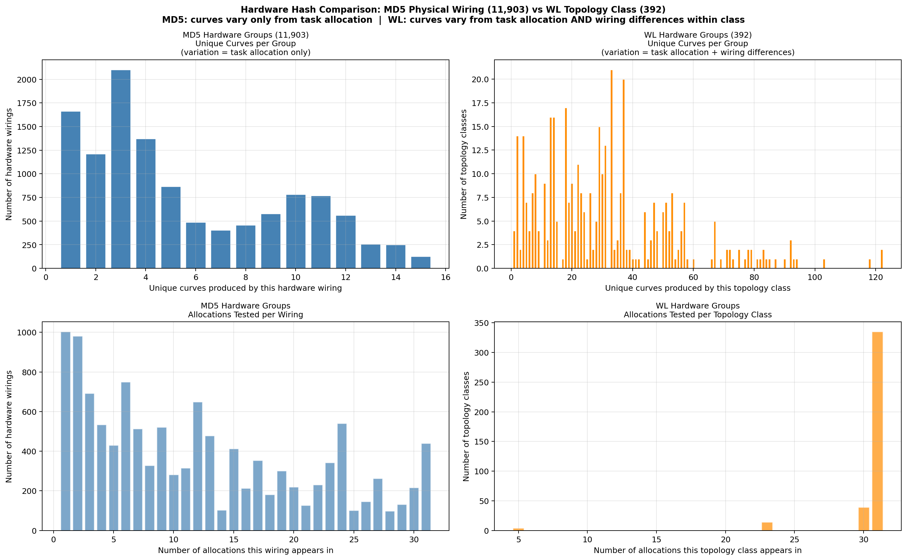
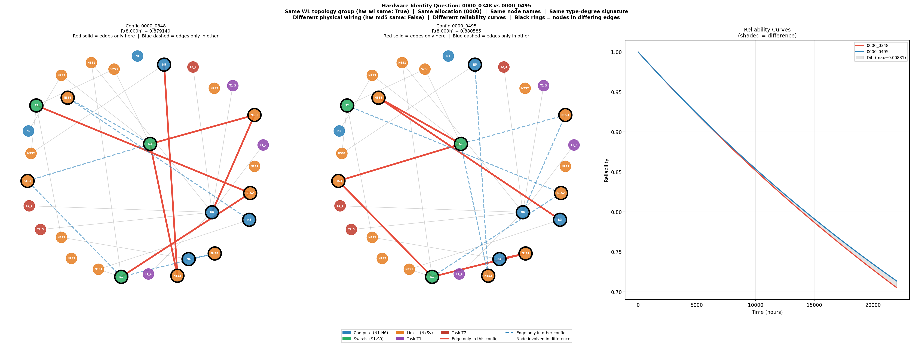

# ADES-v2: Data Discovery Report
**Project:** Reliability Estimation for Embedded Systems via Graph Neural Networks  
**Date:** April 2026  
**Authors:** Manuel Padilla  
**Repository:** [ADES-v2](https://github.com/MPadilla-Dev/ADES-V2)

---

## 1. Context and Motivation

Following your email regarding graph isomorphism and the `is_equal` function in `config.py`, we conducted a thorough analysis of the dataset structure before beginning model training. This report documents our findings from the data exploration phase and outlines the experimental plan for the GNN training phase.

Your note about isomorphism turned out to be one of the most consequential observations of the entire analysis. We spent considerable effort understanding what "same hardware" means in this dataset, and we have an open question for you in Section 4 that directly affects our interpretation of results — though we have designed the experiments to answer it empirically as well.

---

## 2. Dataset Overview

The dataset consists of two raw sources:

| File | Description |
|---|---|
| `config_all_0_22000_100.csv` | 144,255 rows. Each row is one system configuration identified by `{allocation}_{config}`. Columns are reliability values at every 100 hours from t=0h to t=22,000h (221 time points). |
| `matrices.zip` | 144,286 adjacency matrix files. Each file describes one system graph — a header listing node names followed by a 30×30 adjacency matrix. 31 files have no matching CSV entry and are excluded. |

**Graph structure:** Every graph has exactly 30 nodes with a fixed composition:

| Node type | Count | Naming convention |
|---|---|---|
| Compute nodes | 6 | N1 – N6 |
| Switch nodes | 3 | S1 – S3 |
| Link nodes | 15 | N1S1, S1S2 ... (device pair fused into name) |
| Task nodes | 6 | T1\_1, T1\_2, T1\_3, T2\_4, T2\_5, T2\_6 |

Task nodes are actual graph nodes connected to compute nodes. Different task allocations produce genuinely different adjacency matrices — allocation is a **structural variable**, not just a label.

---

## 3. Storage Format — HDF5

The raw data consists of 144k individual text files inside a zip archive. This creates a serious problem on Puhti's Lustre parallel filesystem, which is optimised for large sequential reads, not for opening thousands of small files. During training, a naive dataloader opening one file per sample per batch would issue millions of metadata requests to Lustre, degrading performance for all users.

We convert the entire dataset to a single HDF5 file. HDF5 provides random access by integer index, memory mapping (the file is never fully loaded into RAM), gzip compression, and flexible querying by any stored metadata field without reorganising files. All grouping variables needed for splitting — curve hash, allocation, hardware MD5, hardware WL — are stored as indexed string arrays so any split can be computed at runtime in seconds.

---

## 4. Hardware Configuration Analysis and the Isomorphism Question

### 4.1 Two Levels of Hardware Equivalence

Following your suggestion about isomorphism, we investigated what "same hardware" means in this dataset. We found two defensible definitions that give different answers, and we have designed our experiments to answer empirically which is the more meaningful abstraction.

**Definition A — Same physical wiring (MD5 hash, 11,903 groups):**
Two configurations have the same hardware if their adjacency matrices are identical after removing task node edges. This means exactly the same compute-to-switch and switch-to-switch connections, regardless of task placement. Within an MD5 group, curves vary only because different task allocations place tasks on differently-connected compute nodes.

**Definition B — Same hardware topology class (WL hash, 392 groups):**
Two configurations have the same hardware if their hardware subgraphs are isomorphic — same abstract topology at the node-type level (same degree sequence for compute / switch / link nodes), even if different specific labeled nodes fill different structural roles. Within a WL group, curves can vary from both task allocation differences AND from wiring differences between configs in the same topology class.


*Top row: unique curves produced per group at each hash level. MD5 groups (blue) produce at most 15 unique curves, all from task allocation variation. WL groups (orange) produce up to 122 unique curves, from both task allocation and wiring differences within the topology class. Bottom row: allocations tested per group at each level.*

### 4.2 The Isomorphism Verification

We computed Weisfeiler-Lehman graph hashes on hardware-only subgraphs (task edges stripped, node type as attribute) and found 392 unique topology groups — a 30x reduction from the 11,903 physical wiring groups. We exhaustively verified this using the VF2 algorithm on all 356,589 pairwise combinations within WL groups. **Zero false positives — 392 is mathematically exact.**

### 4.3 The Problem: Isomorphic Hardware, Different Curves

Within a single WL topology group and the same allocation, configurations can produce different reliability curves. We investigated two specific cases: `0000_0348` and `0000_0495`.


*Both configurations belong to the same WL topology group and the same allocation (0000). Red solid edges exist only in `0000_0348`. Blue dashed edges exist only in `0000_0495`. Black rings highlight nodes involved in differing edges. Their reliability curves differ by 0.00144535 at t=8,000h.*

**Key observation:** In `0000_0348`, compute node N6 connects to **two switches**. In `0000_0495`, N6 connects to **only one switch**. Since all six tasks (T1\_1 through T2\_6) connect to N6 in this allocation, N6's switch connectivity determines the redundancy of the entire task communication path. Two switch connections provide more redundancy than one, producing higher reliability.

**The hardware type-degree signatures are identical:**

| Node type | Degree | Count in 0000_0348 | Count in 0000_0495 |
|---|---|---|---|
| compute | 0 | 1 | 1 |
| compute | 1 | 3 | 3 |
| compute | 2 | 2 | 2 |
| switch | 3 | 1 | 1 |
| switch | 4 | 2 | 2 |

Both have the same abstract topology — the WL hash correctly identifies them as isomorphic at the type level. But the specific node with two switch connections is the task host, and its connectivity to the switch network is the dominant reliability factor.

### 4.4 Full Graph Verification

WL hashes on the full 30-node graphs including task edges:

```
Unique full-graph WL hashes : 144,255  (one per sample — every graph unique)
Full WL groups with >1 curve: 0        (every unique graph → one unique curve)
```

The reliability simulation is fully deterministic from the complete graph structure. Identical graphs always produce identical curves.

### 4.5 Open Question for the Domain Expert

We have identified that WL-isomorphic hardware configurations under the same allocation can produce different reliability curves. The curve difference comes from different specific wiring of the task-hosting compute node to the switch network.

**The question is:** In the CTMC model, do all compute nodes (N1 through N6) have **identical failure rates and physical properties**?

- If **yes** — two configurations differing only in which labeled compute node fills a structural role should produce identical reliability. The curve difference we observe (0.00144535) would suggest the WL topology class is too coarse, and the MD5 physical wiring (11,903 groups) is the correct hardware identity.

- If **no** — node labels carry physical meaning, and the curve difference is expected. MD5 physical wiring remains the correct hardware identity.

We have stored both hashes in the dataset and designed experiments using both split levels, so results will be available empirically regardless of the answer.

---

## 5. Key EDA Findings

### 5.1 Dataset Structure

```
144,255 samples
  ├── 31 task allocations  (8 functional symmetry groups)
  ├── 11,903 unique hardware wirings  (MD5, task edges stripped)
  ├── 392 unique hardware topology classes  (WL, VF2-verified)
  └── 3,336 unique reliability curves
```

Task allocation explains **73% of overall reliability variance**. For the same physical hardware, changing which task runs on which compute node produces reliability variation that is 73% as large as varying the hardware entirely.

### 5.2 Reliability Curve Distribution

| Time | Min R | Mean R | Max R | Fraction < 0.9 |
|---|---|---|---|---|
| 1,000h | 0.943 | 0.977 | 0.9997 | 0.0% |
| 4,000h | 0.791 | 0.910 | 0.995 | 38.3% |
| 8,000h | 0.625 | 0.827 | 0.981 | 88.3% |
| 22,000h | 0.275 | 0.585 | 0.883 | 100.0% |

The "nines" classification scheme used in previous work is not applicable at the full time range — all samples fall below 0.9 by t=22,000h. We use regression instead.

### 5.3 Massive Curve Redundancy

```
144,255 total samples
  3,336 unique reliability curves  (2.3%)
140,919 exact duplicates           (97.7%)
```

Many different graph topologies produce identical reliability curves — physically correct, reflecting equivalent redundancy through different structural paths. Train/test splits must be performed at the curve-hash level to prevent target leakage.

### 5.4 Curve Crossings — Static Ranking Is Impossible

Full pairwise comparison of all 3,336 unique curves found a crossing rate of **13.03%**. Of crossing pairs, 38% are moderate or deep (maximum difference > 0.05). A system that is more reliable at t=4,000h may be less reliable at t=15,000h.


*Six crossing examples spanning early (< 5,000h), mid (5,000–12,000h), and late (> 12,000h) crossover times. Shading shows which configuration is genuinely better in each region. Insets zoom around the crossover point.*

A static ranking cannot answer "which configuration is best?" because the answer depends on the intended operating lifetime. This motivates the time-conditioned regression formulation described in Section 6.

### 5.5 Allocation Symmetry Groups

The 31 allocations form 8 functional equivalence classes:

| Unique curves | Allocations |
|---|---|
| 133 | 0002, 0004, 0005, 0010, 0012, 0014, 0015, 0016, 0018, 0019 |
| 388 | 0000, 0001, 0007, 0008, 0009 |
| 421 | 0003, 0011, 0013, 0021, 0022, 0023 |
| 570 | 0006, 0017, 0020, 0026, 0028, 0029 |
| 241 | 0024 |
| 616 | 0025 |
| 969 | 0027 |
| 504 | 0030 |

### 5.6 Architectural Correlation

Task concentration — how many distinct compute nodes carry task connections — is the strongest structural predictor of reliability behavior. This is consistent with the N6 finding: when all tasks connect to a single compute node, that node's switch connectivity becomes the dominant reliability factor.


*Scatter plots of structural features against mean reliability at t=8,000h with Pearson correlation coefficients and trend lines. Color = late/early degradation slope ratio.*

---

## 6. Experimental Plan

### 6.1 Target Formulations

We evaluate three prediction formulations, ordered from primary to supplementary:

---

**Primary — Time-Conditioned Regression**

The model predicts R at a single queried timestep t, where t is provided as an additional node feature. Every node in the graph receives the same t value appended to its 5-dimensional type encoding, making the input 6-dimensional. During training, t is sampled randomly from the 221 available timesteps for each graph in each batch.

```
Input  : graph + t (injected as node feature)
Output : R(t)  — one scalar
Loss   : MSE
```

This formulation directly answers the practical question the system is designed for: *"given this hardware-allocation combination and an intended operating lifetime t, how reliable is it?"* It learns the full degradation curve implicitly across training epochs without needing to predict all 221 points simultaneously. It also handles the crossing problem naturally — queried at the specific t relevant to the deployment context, it gives the correct ranking for that lifetime. This is the closest formulation to the approach used in the previous intake.

---

**Supplementary A — Full Curve Regression**

The model predicts all 221 reliability values simultaneously in a single forward pass.

```
Input  : graph only
Output : [R(0), R(100), ..., R(22000)]  — 221 scalars
Loss   : MSE over all timesteps
```

This is the richest single-pass formulation. It explicitly captures the curve shape including crossings, but requires a 221-dimensional output head and provides 221× more gradient signal per sample which can help or hurt optimisation.

---

**Supplementary B — Single Timestep Regression**

The model predicts R at one fixed timestep (t=8,000h).

```
Input  : graph only
Output : R(8000h)  — one scalar
Loss   : MSE
```

Simple baseline. Cannot handle crossings that occur before or after 8,000h.

---

### 6.2 Split Strategy — Four Axes

Each split axis answers a different scientific question. The accuracy gap between levels is itself a scientific finding.

| Split | Groups | Scientific Question |
|---|---|---|
| **Curve-hash** | 3,336 | Can the model predict reliability values it has never seen? |
| **Allocation** | 31 (8 functional) | Can the model generalise to completely unseen task strategies? |
| **Hardware wiring (MD5)** | 11,903 | Can the model generalise to unseen physical wirings? |
| **Hardware topology (WL)** | 392 | Can the model generalise to unseen hardware topology classes? |

The accuracy gap between MD5 and WL splits empirically answers the open question from Section 4.5.

### 6.3 Experiment Table

| # | Model | Formulation | Split | Status | Notes |
|---|---|---|---|---|---|
| 1 | GAT\_LN\_HEAD | Time-conditioned | Curve-hash | Pending | **Primary experiment** |
| 2 | GAT\_LN\_HEAD | Time-conditioned | Allocation | Pending | Task generalisation |
| 3 | GAT\_LN\_HEAD | Time-conditioned | Hardware wiring (MD5) | Pending | Wiring generalisation |
| 4 | GAT\_LN\_HEAD | Time-conditioned | Hardware topology (WL) | Pending | Topology generalisation |
| 5 | GAT\_LN\_HEAD | Full curve (221 pts) | Curve-hash | Pending | Supplementary comparison |
| 6 | GAT\_LN\_HEAD | Full curve (221 pts) | Allocation | Pending | Supplementary comparison |
| 7 | GAT\_LN\_HEAD | Single timestep R(8k) | Curve-hash | Pending | Simplest baseline |

Experiments 1–4 are the primary set — they test the time-conditioned formulation across all four split strategies, giving a complete picture of what the model generalises to. Experiments 5–6 compare the full curve formulation against time-conditioned on the two most important splits. Experiment 7 provides the simplest possible baseline.

The key comparison is **Exp 1 vs Exp 5** — time-conditioned vs full curve on the same split. If accuracy is similar, the implicit curve learning works as well as explicit prediction. If full curve is better, joint prediction provides useful inductive bias across timesteps.

Results will be reported as MSE and MAE. For crossing pairs we additionally report crossing accuracy — for a queried lifetime t, what fraction of crossing pairs does the model correctly rank?

---

## 7. Pipeline Status

```
src/scripts/
├── 00_verify_data.py         ✅ Done — raw data integrity check
├── 01_preprocess.py          ✅ Done — raw data → dataset.h5
│                                       stores curve_hashes,
│                                       hw_md5_hashes (11,903),
│                                       hw_wl_hashes  (392, VF2-verified)
├── verify_wl_exhaustive.py   ✅ Done — 356,589 VF2 pairs, 0 collisions
├── 02_eda_deep.py            ✅ Done — full EDA including hardware hash
│                                       summary and config comparison
├── 03_split.py               ⏳ Next — produce splits.json
│                                       (curve, allocation, MD5, WL axes)
├── 04_train.py               ⏳ Pending
└── 05_evaluate.py            ⏳ Pending
```

---

*All scripts and documentation are in the [ADES-v2 repository](https://github.com/MPadilla-Dev/ADES-V2). The dataset lives on Puhti scratch and is not committed to git.*