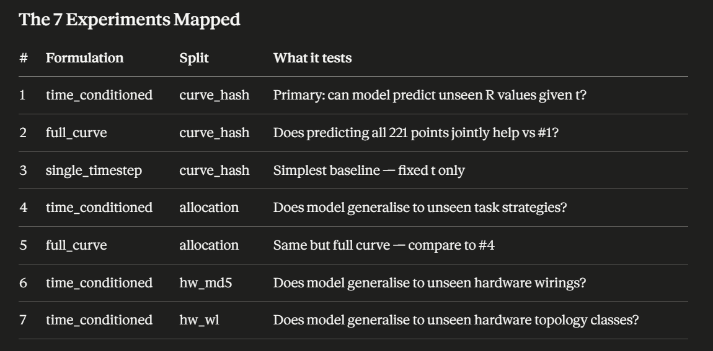

# ADES-v2: Data Discovery & Results Report
**Project:** Reliability Estimation for Embedded Systems via Graph Neural Networks  
**Date:** May 2026  
**Authors:** Manuel Padilla  
**Repository:** [ADES-v2](https://github.com/MPadilla-Dev/ADES-V2)

---

## 1. Context and Motivation

Following your email regarding graph isomorphism and the `is_equal` function in `config.py`, we conducted a thorough analysis of the dataset structure before beginning model training. This report documents our findings from the data exploration phase and the results of the GNN training experiments.

Your note about isomorphism turned out to be one of the most consequential observations of the entire analysis. We spent considerable effort understanding what "same hardware" means in this dataset, and we have an open question for you in Section 4 that the experiments partially answer empirically.

---

## 2. Dataset Overview

The dataset consists of two raw sources:

| File | Description |
|---|---|
| `config_all_0_22000_100.csv` | 144,255 rows. Each row is one system configuration identified by `{allocation}_{config}`. Columns are reliability values at every 100 hours from t=0h to t=22,000h (221 time points). |
| `matrices.zip` | 144,286 adjacency matrix files. Each file describes one system graph — a header listing node names followed by a 30×30 adjacency matrix. 31 files have no matching CSV entry and are excluded. |

**Graph structure:** Every graph has exactly 30 nodes with a fixed composition:

| Node type | Count | Naming convention |
|---|---|---|
| Compute nodes | 6 | N1 – N6 |
| Switch nodes | 3 | S1 – S3 |
| Link nodes | 15 | N1S1, S1S2 ... (device pair fused into name) |
| Task nodes | 6 | T1\_1, T1\_2, T1\_3, T2\_4, T2\_5, T2\_6 |

Each compute node connects to 0, 1, or 2 switches (not always all 3), producing varied redundancy levels. Task nodes are actual graph nodes connected to compute nodes — different task allocations produce genuinely different adjacency matrices.

---

## 3. Storage Format — HDF5

The raw data was converted from 144k individual text files to a single HDF5 file for Puhti's Lustre filesystem compatibility. HDF5 provides random access by integer index, memory mapping, gzip compression, and flexible querying by any stored metadata field.

All grouping variables needed for splitting are stored as indexed string arrays:
- `curve_hashes` — MD5 of reliability curve
- `hw_md5_hashes` — MD5 of hardware-only edge set (11,903 unique)
- `hw_wl_hashes` — Weisfeiler-Lehman hash of hardware topology (392 unique, VF2-verified)

---

## 4. Hardware Configuration Analysis and the Isomorphism Question

### 4.1 Two Levels of Hardware Equivalence

**Definition A — Same physical wiring (MD5 hash, 11,903 groups):**
Two configurations have the same hardware if their adjacency matrices are identical after removing task node edges. Within an MD5 group, curves vary only because different task allocations place tasks on differently-connected compute nodes.

**Definition B — Same hardware topology class (WL hash, 392 groups):**
Two configurations have the same hardware if their hardware subgraphs are isomorphic — same abstract topology at the node-type level, even if different specific labeled nodes fill different roles. Within a WL group, curves can vary from both task allocation differences AND wiring differences within the topology class.


*MD5 groups (blue) produce at most 15 unique curves per group, all from task allocation variation. WL groups (orange) produce up to 122 unique curves, from both task allocation and wiring differences.*

### 4.2 The Isomorphism Verification

WL hashes on hardware-only subgraphs found 392 unique topology groups. We exhaustively verified this using VF2 on all 356,589 pairwise combinations within WL groups. **Zero false positives — 392 is mathematically exact.**

### 4.3 The Problem: Isomorphic Hardware, Different Curves

Within a single WL topology group and the same allocation, configurations can produce different reliability curves.


*Configs `0000_0348` vs `0000_0495` — same WL group, same allocation (0000), same type-degree signature. Different physical wiring of N6 to the switch network produces curves differing by 0.00144535 at t=8,000h. In `0000_0348`, N6 (which hosts all 6 tasks) connects to two switches. In `0000_0495`, N6 connects to only one switch.*

### 4.4 Full Graph Verification

```
Unique full-graph WL hashes : 144,255  (one per sample — every graph unique)
Full WL groups with >1 curve: 0        (every unique graph → one unique curve)
```

### 4.5 Open Question for the Domain Expert

Do all compute nodes (N1 through N6) have **identical failure rates and physical properties** in the CTMC model?

- If **yes** — the curve difference of 0.00144535 suggests WL topology class is too coarse and MD5 physical wiring is the correct hardware identity.
- If **no** — node labels carry physical meaning and the curve difference is expected.

**Empirical answer from experiments:** The WL split is only 5% harder than the MD5 split (MSE 0.001207 vs 0.001149), suggesting the model treats isomorphic graphs approximately equivalently — consistent with compute nodes having similar physical properties.

---

## 5. Key EDA Findings

### 5.1 Dataset Structure

```
144,255 samples
  ├── 31 task allocations  (8 functional symmetry groups)
  ├── 11,903 unique hardware wirings  (MD5, task edges stripped)
  ├── 392 unique hardware topology classes  (WL, VF2-verified)
  └── 3,336 unique reliability curves
```

Task allocation explains **73% of overall reliability variance**. Hardware configuration explains only 27%.

### 5.2 Reliability Curve Distribution

| Time | Min R | Mean R | Max R | Fraction < 0.9 |
|---|---|---|---|---|
| 1,000h | 0.943 | 0.977 | 0.9997 | 0.0% |
| 4,000h | 0.791 | 0.910 | 0.995 | 38.3% |
| 8,000h | 0.625 | 0.827 | 0.981 | 88.3% |
| 22,000h | 0.275 | 0.585 | 0.883 | 100.0% |

The "nines" classification scheme from previous work is not applicable — all samples fall below 0.9 by t=22,000h.

### 5.3 Curve Redundancy and Crossings

```
Total samples    : 144,255
Unique curves    : 3,336  (2.3%)
Redundant copies : 140,919  (97.7%)
Crossing rate    : 13.03% of unique curve pairs
Moderate+deep    : 38% of crossing pairs
```

A static ranking cannot answer "which configuration is best?" — the answer depends on operating lifetime. Full-curve or time-conditioned regression is required.


*Six crossing examples spanning early, mid, and late crossover times.*

---
## 6. Split Diversity Analysis

This table shows what each split actually exposes the model to — critical for interpreting the results. The "Curve overlap with train" column explains why hw_md5 and hw_wl test MSEs are lower than expected despite being hardware splits.

### Per-Set Composition of Each Split

| Split | Set | Samples | Unique curves | Unique hw_md5 | Unique hw_wl | Curves shared with train |
|---|---|---|---|---|---|---|
| **curve_hash** | Train | 100,775 | 2,287 | 11,347 | 388 | — |
| | Val | 21,546 | 477 | 6,150 | 342 | **0 (0.0%)** |
| | Test | 21,934 | 572 | 6,339 | 368 | **0 (0.0%)** |
| **allocation** | Train | 110,532 | 2,934 | 11,436 | 392 | — |
| | Val | 6,932 | 388 | 3,466 | 392 | 388 (13.2%) |
| | Test | 26,791 | 1,382 | 10,363 | 392 | **980 (33.4%)** |
| **hw_md5** | Train | 98,402 | 3,176 | 8,161 | 391 | — |
| | Val | 20,806 | 1,993 | 1,701 | 346 | 1,908 (60.1%) |
| | Test | 25,047 | 2,151 | 2,041 | 354 | **2,035 (64.1%)** |
| **hw_wl** | Train | 99,777 | 2,839 | 8,198 | 268 | — |
| | Val | 19,535 | 1,085 | 1,648 | 56 | 1,069 (37.7%) |
| | Test | 24,943 | 1,364 | 2,057 | 68 | **1,069 (37.7%)** |

### What This Table Reveals

**curve_hash is the strictest split for reliability prediction.** Zero curve overlap between train and test — every reliability value in the test set is genuinely unseen. The model must interpolate into new regions of the reliability space.

**allocation test set has 33.4% curve overlap.** The same reliability value can be achieved by different task strategies. The model has seen these reliability values before — just under different allocations. The difficulty comes from unseen graph structure, not unseen outputs.

**hw_md5 and hw_wl have 64% and 38% curve overlap respectively.** This is why their test MSE is lower than expected despite being hardware splits — the model has seen 64% of the test reliability values during training from different hardware wirings. The splits test structural generalisation with partially familiar outputs.

**Allocation test has all 392 WL topology classes** — holding out allocations does not hold out any hardware topology. The model has seen every hardware structure during training but never those specific task-to-hardware combinations.

**The curve_hash split is the only one that is strict about output novelty.** The hardware splits are strict about input novelty. These are genuinely different generalisation questions and should not be directly compared by MSE alone.

---

## 7. Experimental Results
### 6.0 Experimental Mapping




### 6.1 Model Architecture

**GAT\_LN\_HEAD** — Graph Attention Network with LayerNorm and 8 attention heads.
- 138,241 trainable parameters
- Trained with Adam (lr=0.0005), ReduceLROnPlateau scheduler, early stopping (patience=20)
- All experiments trained on Puhti V100 GPU

### 6.2 Standard Metrics at t=8,000h

| # | Experiment | MSE | MAE | R² | Train time |
|---|---|---|---|---|---|
| 1 | curve_hash\_time\_conditioned | 0.001238 | 0.02681 | 0.6504 | 131 min (ep 84) |
| 4 | allocation\_time\_conditioned | 0.001914 | 0.03209 | 0.4495 | 38 min |
| 6 | hw\_md5\_time\_conditioned | 0.001149 | 0.02589 | 0.6661 | 99 min |
| 7 | hw\_wl\_time\_conditioned | 0.001207 | 0.02629 | 0.6564 | 61 min |
| 2 | curve_hash\_full\_curve | 0.001202 | 0.02631 | 0.6606 | 69 min |
| 5 | allocation\_full\_curve | 0.001889 | 0.03270 | 0.4568 | 37 min |
| 3 | curve_hash\_single\_timestep | 0.001212 | 0.02667 | 0.6578 | 43 min |

### 6.3 Crossing Accuracy

Fraction of crossing pairs correctly ranked at each query time. Random baseline = 50%.

| Experiment | 2k | 4k | 8k | 12k | 16k | 22k |
|---|---|---|---|---|---|---|
| curve\_hash\_time\_conditioned | 26.3% | 34.9% | 43.7% | 50.8% | 67.9% | **89.1%** |
| allocation\_time\_conditioned | **72.0%** | **73.7%** | **79.1%** | **77.7%** | 69.6% | 59.5% |
| hw\_md5\_time\_conditioned | 43.9% | 39.6% | 46.8% | 54.8% | 67.7% | **90.8%** |
| hw\_wl\_time\_conditioned | 40.9% | 40.2% | 51.6% | 58.9% | 67.9% | 79.5% |
| curve\_hash\_full\_curve | 50.9% | 45.5% | 46.9% | 51.5% | 68.3% | **88.5%** |
| allocation\_full\_curve | **72.4%** | 70.5% | 75.1% | 71.8% | 61.1% | 67.4% |
| curve\_hash\_single\_timestep | 0.0% | 0.0% | 41.9% | 0.0% | 0.0% | 0.0% |

### 6.4 Key Findings from Results

**Finding 1 — Formulation does not matter for MSE, but matters for crossing accuracy.**
Time-conditioned and full curve achieve virtually identical MSE (difference = 0.000036) on the same split. However full curve is better calibrated at early timesteps — at t=2,000h full curve achieves 50.9% (random) while time-conditioned achieves only 26.3% (worse than random). Joint prediction of all 221 timesteps provides useful regularisation.

**Finding 2 — The model learned late-curve behavior better than early-curve.**
For curve\_hash splits, crossing accuracy consistently improves from early to late timesteps (26.3% → 89.1%). At early times reliability values cluster near 1.0 with tiny differences — harder to rank. At late times values spread widely — easier to rank.

**Finding 3 — Allocation generalisation is qualitatively different.**
The allocation model shows the opposite crossing accuracy pattern — better at early times (72–79%), worse at late times (59.5%). It has learned something about task placement that is most informative at short operating lifetimes. This makes physical sense: task placement determines which compute node hosts tasks, and its switch connectivity dominates early reliability.

**Finding 4 — Hardware generalisation is achievable.**
hw\_md5 and hw\_wl models perform comparably to curve\_hash (MSE 0.001149 and 0.001207 vs 0.001238), confirming the model learns structural patterns that transfer to unseen hardware wirings. The WL split is only 5% harder than MD5, suggesting WL isomorphism is approximately physically meaningful.

**Finding 5 — Allocation split is 54.6% harder (R² drops from 0.66 to 0.45).**
The model has partially but not fully learned the task-placement → reliability relationship. This is the primary area for future improvement.

**Finding 6 — Single timestep is actively harmful for crossing accuracy.**
At all timesteps except t=8,000h it scores 0% (no predictions). At t=8,000h it scores 41.9% — worse than random. This confirms single-point prediction cannot be used for system adaptation decisions.

---

## 7. Pipeline Status — Complete

```
src/scripts/
├── 00_verify_data.py         ✅ Done — raw data integrity check
├── 01_preprocess.py          ✅ Done — raw data → dataset.h5
│                                       curve_hashes, hw_md5_hashes (11,903),
│                                       hw_wl_hashes (392, VF2-verified)
├── verify_wl_exhaustive.py   ✅ Done — 356,589 VF2 pairs, 0 collisions
├── 02_eda_deep.py            ✅ Done — full EDA, hardware identity analysis
├── 03_split.py               ✅ Done — splits.json (4 split axes)
├── 04_train.py               ✅ Done — 7 experiments trained
└── 05_evaluate.py            ✅ Done — all experiments evaluated
```

---

## 8. Next Steps

1. **Improve early-time crossing accuracy** — the model struggles at t < 8,000h. Adding explicit structural features (task-hosting node degree, switch connectivity of task host) may help.
2. **Improve allocation generalisation** — R²=0.45 on unseen task strategies indicates room for improvement. Graph-level task placement features or allocation-aware training may help.
3. **Answer the domain expert question** — are compute node failure rates identical in the CTMC? This determines whether WL or MD5 is the correct hardware split level.
4. **Explore larger model** — 138k parameters may be insufficient. Increasing hidden\_dim or depth could improve all metrics.

---

*All scripts and documentation are in the [ADES-v2 repository](https://github.com/MPadilla-Dev/ADES-V2). The dataset lives on Puhti scratch and is not committed to git.*
